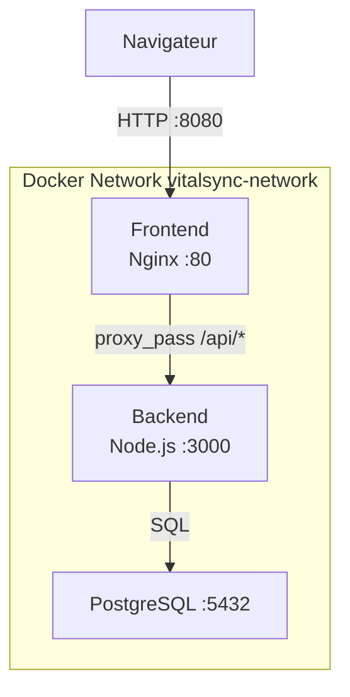

# VitalSync

Application de suivi médical et sportif — projet EFREI E6 CI/CD conteneurisée.

## Architecture



## Prérequis

- Docker >= 24.x
- Docker Compose >= 2.x (intégré à Docker Desktop)
- Node.js >= 20.x (développement local uniquement)
- Git >= 2.x

## Lancer l'application en local

1. Cloner le dépôt :
```bash
git clone https://github.com/julesdpo/VitalSync.git
cd VitalSync
```

2. Créer le fichier `.env` à partir de l'exemple :
```bash
cp .env.example .env
# Éditer .env et renseigner POSTGRES_PASSWORD
```

3. Démarrer les services :
```bash
docker compose up --build
```

4. Accéder à l'application : http://localhost:8080

## Structure du projet

```
vitalsync/
├── backend/
│   ├── server.js           # API Node.js/Express
│   ├── package.json
│   ├── Dockerfile          # Multi-stage build
│   ├── .dockerignore
│   └── test/
│       └── health.test.js  # Tests Jest
├── frontend/
│   ├── index.html          # Interface React statique
│   ├── nginx.conf          # Config Nginx + proxy_pass
│   └── Dockerfile
├── k8s/
│   ├── backend-deployment.yml
│   ├── backend-service.yml
│   ├── frontend-ingress.yml
│   └── secret.yml
├── .github/
│   └── workflows/
│       └── ci.yml          # Pipeline GitHub Actions
├── docker-compose.yml
├── .env.example
└── README.md
```

## Pipeline CI/CD

La pipeline GitHub Actions se déclenche :
- Sur chaque **push sur `develop`**
- Sur chaque **Pull Request vers `main`**

Elle exécute 3 étapes séquentielles :

| Étape | Actions |
|---|---|
| **Lint & Tests** | `npm ci` + Jest + ESLint |
| **Build & Push** | Build images Docker, tag SHA commit, push vers GHCR |
| **Deploy Staging** | `docker compose up`, health check sur `/health` |

## Choix techniques

| Composant | Choix | Justification |
|---|---|---|
| Registry | GHCR | Natif GitHub, GITHUB\_TOKEN suffit |
| Image base backend | node:20-alpine | LTS + Alpine = légère et sécurisée |
| Image base frontend | nginx:alpine | Minimaliste, idéal pour fichiers statiques |
| Build Dockerfile | Multi-stage | Tests en stage 1, image propre en stage 2 |
| Réseau Docker | Bridge nommé | DNS par nom de service + isolation |
| Secrets CI | GitHub Secrets | Chiffrés, jamais exposés dans les logs |
| Commits | Conventional Commits | Lisibilité, changelogs automatiques |
